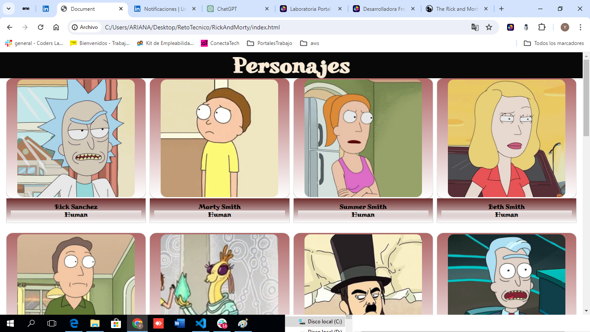

# CONSUMO DE LA API DE RICK AND MORTY

En este proyecto se realizó el consumo de la API de Rick and Morty (https://rickandmortyapi.com/).

Captura de pantalla de la API de Rick and Morty

# Tipografía:
Se utilizó la tipografía de Google Fonts "Miltonian Tattoo".

# Imágenes del proyecto:
Captura de pantalla del proyecto

